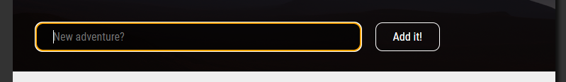
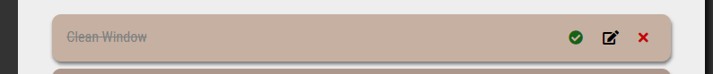
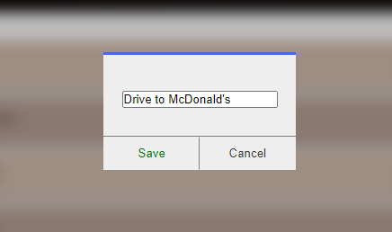
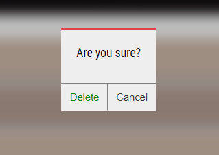

# ToDoApp!

## Live version: [Live](https://michalb.unixstorm.eu/)

## Table of contents

- [Description](#description)

- [How to use](#how-to-use)

- [Installation](#installation)

## Description

**DoList** is an app, that I made alone with use of PHP and AJAX. It's simple CRUD App where you can add some tasks, edit or remove them. App saves tasks on server side (about connecting app you will read in [installation](#installation) section). Try it live [here](https://michalbali.unixstorm.eu/)!

## How to use

### Adding new task

Write your task and hit the button :) - the app has form validation and sanitize this input! The placeholder of input changes randomly every time the page is reloded.



Your new Task will be added at the end of the list.

### Marking as done

If you want to Mark as done one of your taks, you can do it by clicking green on the right side of task. Then, the task will have grey color and line through.



### Editing task

To edit your task, just hit the edit (black) button, the form with your task text will appear on screen.



Change the text and click Save. Good, your task was updated. You can cancel editing without saving the changes by clicking out of modal or cancel button.

### Removing task

To remove the task just click X button, on screen should appear modal with "are you sure" question. If you really want to delete this task, push the delete button, if not just click somewhere out of modal or cancel button.



### No task avaliable

If there will be no tasks to show, the app will inform you about that fact.

## Installation

### Project setup

You have to set dsn adress in /php/database.php file:

```
   protected $dsn = "PROVIDE_YOURS :)";
    protected $username = 'PROVIDE_YOURS :)';
    protected $password = 'PROVIDE_YOURS :)';

    public function connection()
    {
        return new PDO($dsn = $this->dsn, $username = $this->username, $password = $this->password);
    }

```

If you want to run the app on Xampp, default pass are:

```
 protected $dsn = "mysql:host=localhost; dbname=todo_bd";
    protected $username = 'root';
    protected $password = '';

```
